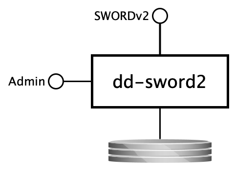

dd-sword2
=========

DANS SWORD v2 based deposit service

SYNOPSIS
--------

    dd-sword2 { server | check }

DESCRIPTION
-----------

### Overview

#### Context

The `dd-sword2` service is the [DANS]{:target=_blank} implementation of the [SWORDv2]{:target=_blank} protocol. It is a rewrite in Java of the Scala-based
project [easy-sword2]{:target=_blank}. Like its predecessor, it does **not** implement the full SWORDv2 specifications. Also, since the SWORDv2 specs leave
various important issues up to the implementer, the service adds some features.

The best starting point for learning about `dd-sword2` is this document. Where appropriate, this document contains references to the
[SWORDv2 specifications document]{:target=_blank}. When reading the SWORDv2 docs, keep in mind that it is itself built on other specifications, and refers to
those often, especially:

* [AtomPub]{:target=_blank}
* [Atom]{:target=_blank}
* [HTTP]{:target=_blank}

#### Purpose of the service

At the highest level `dd-sword2` is a service that accepts ZIP packages that comply with the [BagIt]{:target=_blank} packaging format and produces a
[deposit directory]{:target=_blank} for each.

### Interfaces (provided)

The service has the following interfaces.

{:width=50%}

#### SWORDv2

* _Protocol type_: HTTP
* _Internal or external_: **external**
* _Purpose_: depositing packages, submitting them for archival processing and tracking progress

#### Deposit directories

* _Protocol type_: Shared filesystem
* _Internal or external_: **internal**
* _Purpose_: handing packages to the post-submission processing service and reporting back status changes written by that service to the `deposit.properties`
  files of the deposit directories

#### Admin console

* _Protocol type_: HTTP
* _Internal or external_: **internal**
* _Purpose_: application monitoring and management

### Interfaces (consumed)

The service consumes the following interfaces.

#### Auth delegate

* _Protocol type_: HTTP Basic Auth
* _Internal or external_: **internal**
* _Purpose_: delegate basic auth authentication of a client for SWORD2

### Processing

The following sections describe the interaction of a client with the SWORDv2 interface. The examples are [curl]{:target=_blank} commands. The meaning of the
shell variables is as follows:

| Variable           | Meaning                                                                                                                 |
|--------------------|-------------------------------------------------------------------------------------------------------------------------|
| `USER`             | user name of sword client                                                                                               |
| `PASSWORD`         | password of the sword client                                                                                            |
| `SWORD_BASE_URL`   | the base URL of the SWORD service <br/>(the same URL is configured in [config.yml]{:target=_blank} as `sword2.baseUrl`) |
| `SWORD_COL_IRI`    | the URL of the collection that the deposit is sent to                                                                   |
| `SWORD_EDIT_IRI`   | the URL to send subsequent parts to in a continued deposit                                                              | 

#### Getting the service document

The [service document]{:target=_blank} is an XML document that lets the client discover the capabilities and the supported collections of the service. It can
be [retrieved](https://swordapp.github.io/SWORDv2-Profile/SWORDProfile.html#protocoloperations_retreivingservicedocument){:target=_blank} with a simple
GET request:

```bash
curl -X GET -u $USER:$PASSWORD $SWORD_BASE_URL/servicedocument
```

!!! tip "Pretty printing XML"
   
    Use [xmllint]{:target=_blank} to display XML output in a more readable format (the final dash is intentional!):

    ```
    curl -X GET -u $USER:$PASSWORD $SWORD_BASE_URL/servicedocument | xmllint --format - 
    ```

#### Creating and submitting a deposit

A deposit is created by [binary file deposit]{:target=_blank}. The other options that SWORDv2 specifies are currently not supported. Furthermore, the only
[packaging]{:target=_blank} that is supported is `http://purl.org/net/sword/package/BagIt`. This means that:

* the payload of the upload must be a ZIP file containing a [bag]{:target=_blank};
* the `Packaging` header must be set to `http://purl.org/net/sword/package/BagIt`.

It is furthermore **mandatory** to send along the `Content-MD5` header. (Note that SWORD2 requires the content of this header to be a **hex encoded** MD5
digest, rather than the base64 encoded MD5 digest specified in [RFC1864]{:target=_blank} about Content-MD5.)

If `bag.zip` is such a ZIP file, then it can be uploaded as follows:

```bash
export BAG=bag.zip
curl -X POST \
     -H 'Content-Type: application/zip' \
     -H 'Content-Disposition: attachment; filename=bag.zip' \
     -H "Content-MD5: $(md5 -q $BAG)" \ 
     -H 'Packaging: http://purl.org/net/sword/package/BagIt' \
     --data-binary @$BAG -u $USER:$PASSWORD $SWORD_COL_IRI
```

(The `md5` command used above is the one from BSD and MacOS. You may have to get the correct output in a different way on other systems.
On Linux you can use `$(md5sum $BAG | cut -d ' ' -f)`.)

If the upload is successful, the client will receive a [deposit receipt]{:target=_blank}. This is an Atom Entry document that contains, among other things, the
statement URL (Stat-IRI), which is the URL the client can use to [track post-submision processing](#tracking-post-submission-processing).

#### Continued deposit

If the bag to be uploaded is larger than 1G it is recommended to use a [continued deposit]{:target=_blank}. The client must split the ZIP file into chunks and
send these in separate requests with the `In-Progress` header set to `true` for all chunks except the last. The names of the chunk files must be: the name of
the complete ZIP file, extended with `.n`, where n is the sequence number.

**(1)** The first chunk is sent to the collection URL ([Col-IRI]{:target=_blank} in SWORD terms), **(2)** the subsequent chunks are sent to the SWORD "edit" URL
([SE-IRI]{:target=_blank}), which can be found in the deposit receipt of the first upload.

The client indicates that it will be sending more chunks by including the header `In-Progress: true`. Since the content of each separate chunk is not a valid
ZIP file, the `Content-Type` must be set to `application/octet-stream` (which is a fancy way of saying the content consists of bytes).

If `bag.zip.1`, `bag.zip.2` and `bag.zip.3` are the chunks created by splitting `bag.zip`, they can be uploaded as follows:

**Step (1)**

```bash
export BAG=bag.zip
curl -X POST \
     -H 'Content-Type: application/octet-stream' \
     -H 'Content-Disposition: attachment; filename=bag.zip.1' \
     -H 'In-Progress: true' \
     -H "Content-MD5: $(md5 -q ${BAG}.1)" \ 
     -H 'Packaging: http://purl.org/net/sword/package/BagIt' \
     --data-binary @${BAG}.1 -u $USER:$PASSWORD $SWORD_COL_IRI
```

If the upload is successful the server will respond with a download receipt:

```xml
<entry xmlns="http://www.w3.org/2005/Atom">
    <generator uri="http://www.swordapp.org/" version="2.0"/>
    <id>https://swordserver.org/sword2/container/a5bb644a-78a3-47ae-907a-0bdf162a0cd4</id>
    <link href="https://swordserver.org/sword2/container/a5bb644a-78a3-47ae-907a-0bdf162a0cd4" rel="edit"/>
    <link href="https://swordserver.org/sword2/container/a5bb644a-78a3-47ae-907a-0bdf162a0cd4" rel="http://purl.org/net/sword/terms/add"/>
    <link href="https://swordserver.org/sword2/media/a5bb644a-78a3-47ae-907a-0bdf162a0cd4" rel="edit-media"/>
    <packaging xmlns="http://purl.org/net/sword/terms/">http://purl.org/net/sword/package/BagIt</packaging>
    <link href="https://swordserver.org/sword2/statement/a5bb644a-78a3-47ae-907a-0bdf162a0cd4" rel="http://purl.org/net/sword/terms/statement"
          type="application/atom+xml; type=feed"/>
    <treatment xmlns="http://purl.org/net/sword/terms/">[1] unpacking [2] verifying integrity [3] storing persistently</treatment>
    <verboseDescription xmlns="http://purl.org/net/sword/terms/">received successfully: bag.zip.1; MD5: 494dd614e36edf5c929403ed7625b157</verboseDescription>
</entry>
```

**Step (2)**

Parts 2 and 3 sent to the SWORD "edit" URL ([SE-IRI]{:target=_blank}). It can be retrieved from the deposit receipt by finding the link element
with `rel="edit"`. In the example this is `https://swordserver.org/sword2/container/a5bb644a-78a3-47ae-907a-0bdf162a0cd4`.

```bash
curl -X POST \
     -H 'Content-Type: application/octet-stream' \
     -H 'Content-Disposition: attachment; filename=bag.zip.2' \
     -H 'In-Progress: true' \
     -H "Content-MD5: $(md5 -q ${BAG}.2)" \ 
     -H 'Packaging: http://purl.org/net/sword/package/BagIt' \
     --data-binary @${BAG}.2 -u $USER:$PASSWORD $SWORD_EDIT_IRI
```

For the last part the `In-Progress` header is set to false.

```bash
curl -X POST \
     -H 'Content-Type: application/octet-stream' \
     -H 'Content-Disposition: attachment; filename=bag.zip.3' \
     -H 'In-Progress: false' \
     -H "Content-MD5: $(md5 -q ${BAG}.3)" \ 
     -H 'Packaging: http://purl.org/net/sword/package/BagIt' \
     --data-binary @${BAG}.3 -u $USER:$PASSWORD $SWORD_EDIT_IRI
```

After this, the client will have to wait for the server to process the deposit. It should [track the progress](#tracking-post-submission-processing) until the
the server has confirmed that the deposit was fully processed.

#### Finalizing a deposit

When the client sends (the first part of) a bag, the server creates a draft [deposit directory]{:target=_blank}. As long as the client is uploading parts of the
deposit, the state of the deposit directory is `DRAFT`. When the last part has been received, the state becomes `UPLOADED`. An "uploaded" deposit is waiting for
finalization. When a finalization worker becomes available it will:

1. change the state of the deposit to `FINALIZING`;
2. concatenate the parts uploaded in a continued deposit into one file in the order indicated by the sequences numbers at the endings of the file names (in a
   simple deposit this is skipped, of course);
3. unzip the file (if this fails, the deposit becomes `INVALID`);
4. validate that resulting directory complies with the [BagIt]{:target=_blank} specs (if this fails, the deposit becomes `INVALID`);
5. change the state to `SUBMITTED`;
6. move the deposit to the directory configured for the collection in `sword2.collections.<collection>.deposits`. (See [config.yml]{:target=_blank}.)

(Any error **other** than the upload not being a valid ZIP file or not being a valid bag, will cause the deposit to transition to a `FAILED` state. In other
words,`INVALID` indicates faulty input by the client, `FAILED` means that the server was misconfigured or was experiencing other problems.)

After this `dd-sword2`, will **not write to the deposit in any way**. In other words, by moving the deposit tot he deposits directory `dd-sword2` hands over
further processing to a post-submission process. The only thing that `dd-sword2` will continue to do is to serve the client the SWORD Statement whenever
requested. This ensures the client can keep track of the deposit even after `dd-sword2` is finished with it.

#### Tracking post-submission processing

As soon as the deposit exists, the client can track its state by downloading the SWORD [statement]{:target=_blank} from the Statement URL
([Stat-IRI]{:target=_blank}). This URL can be found in the deposit receipt in the link with the attribute `rel="http://purl.org/net/sword/terms/statement"`.

A SWORD Statement is an Atom Feed document (the RDF/XML serialization is currently *not* supported by `dd-sword2`), for example:

```xml

<feed xmlns="http://www.w3.org/2005/Atom">
    <id>$SWORD_STAT_IRI</id>
    <link href="$SWORD_STAT_IRI" rel="self"/>
    <title type="text">Deposit a5bb644a-78a3-47ae-907a-0bdf162a0cd4</title>
    <author>
        <name>user</name>
    </author>
    <updated>2019-05-23T14:51:15.356Z</updated>
    <category term="ARCHIVED" scheme="http://purl.org/net/sword/terms/state" label="State"/>
    <entry>
        <content type="multipart/related" src="urn:uuid:a5bb644a-78a3-47ae-907a-0bdf162a0cd4"/>
        <id>urn:uuid:a5bb644a-78a3-47ae-907a-0bdf162a0cd4</id>
        <title type="text">Resource urn:uuid:a5bb644a-78a3-47ae-907a-0bdf162a0cd4</title>
        <summary type="text">Resource Part</summary>
        <updated>2019-05-23T14:51:22.342Z</updated>
        <link href="https://doi.org/10.5072/dans-Lwgy-zrn-jfyy" rel="self"/>
    </entry>
</feed>
```

The [statement]{:target=_blank} provides information about the deposit as it is processed by the server (`dd-sword2` and any post-submission process), most
importantly the current state of the deposit. This can be found in the `<category>` element with the `scheme` attribute set
to `http://purl.org/net/sword/terms/state`. The `term` attribute of this element contains the current state. The table below lists the states implemented
by `dd-sword2` and their meaning. The post-submission process can set the state by updating the `state.label` and `state.description` properties in
the [deposit.properties file]{:target=_blank}. The state labels it uses are transparent to `dd-sword2`. It may for example use `ARCHIVED` to indicate that
post-submission processing has finished with successfully archiving the deposit.

| State        | Description                                                                                                                                                                                                                                  |
|--------------|----------------------------------------------------------------------------------------------------------------------------------------------------------------------------------------------------------------------------------------------|
| `DRAFT`      | The deposit is being prepared by the depositor. It is not submitted to the archive yet <br/> and still open for additional data.                                                                                                             |
| `UPLOADED`   | The deposit is in the process of being submitted. It is waiting to be finalized. The data<br/> is completely uploaded. It will automatically move to the next stage and the status will <br/> be updated accordingly.                        | 
| `FINALIZING` | The deposit is in the process of being submitted. It is being checked for validity. It will <br/>  automatically move to the next stage and the status will be updated accordingly.                                                          |
| `INVALID`    | The deposit is not accepted by the archive as the submitted bag is not valid. <br/>The description will detail what part of the bag is not according to specifications. <br/>The depositor is asked to fix the bag and resubmit the deposit. |
| `SUBMITTED`  | The deposit is submitted for processing. `dd-sword2` will not update it anymore <br/> and limit itself to providing a Statement document on request.                                                                                         |
| `FAILED`     | An error occurred while processing the deposit                                                                                                                                                                                               | 

ARGUMENTS
---------

        positional arguments:
        {server,check}         available commands
        
        named arguments:
        -h, --help             show this help message and exit
        -v, --version          show the application version and exit

EXAMPLES
--------

Java client code examples are available in [dd-dans-sword2-examples]{:target=_blank}.

INSTALLATION
------------
Currently this project is built as an RPM package for RHEL7/CentOS7 and later. The RPM will install the binaries to
`/opt/dans.knaw.nl/dd-sword2` and the configuration files to `/etc/opt/dans.knaw.nl/dd-sword2`.

For installation on systems that do no support RPM and/or systemd:

1. Build the tarball (see next section).
2. Extract it to some location on your system, for example `/opt/dans.knaw.nl/dd-sword2`.
3. Start the service with the following command
   ```bash
   /opt/dans.knaw.nl/dd-sword2/bin/dd-sword2 server /opt/dans.knaw.nl/dd-sword2/cfg/config.yml 
   ```

CONFIGURATION
-------------
This service can be configured by changing the settings in [config.yml]{:target=_blank}. See the comments in that file for more information.

BUILDING FROM SOURCE
--------------------
Prerequisites:

* Java 11 or higher
* Maven 3.3.3 or higher
* RPM

Steps:

    git clone https://github.com/DANS-KNAW/dd-sword2.git
    cd dd-sword2 
    mvn clean install

If the `rpm` executable is found at `/usr/local/bin/rpm`, the build profile that includes the RPM packaging will be activated. If `rpm` is available, but at a
different path, then activate it by using Maven's `-P` switch: `mvn -Prpm install`.

Alternatively, to build the tarball execute:

    mvn clean install assembly:single

[DANS]: https://www.dans.knaw.nl/

[SWORDv2]: https://sword.cottagelabs.com/previous-versions-of-sword/sword-v2/

[easy-sword2]: https://dans-knaw.github.io/easy-sword2/

[BagIt]: https://datatracker.ietf.org/doc/html/rfc8493

[bag]: https://datatracker.ietf.org/doc/html/rfc8493

[deposit directory]: https://dans-knaw.github.io/dans-datastation-architecture/deposit-directory/

[deposit.properties file]: https://dans-knaw.github.io/dans-datastation-architecture/deposit-directory/#depositproperties

[dd-dans-sword2-examples]: https://github.com/DANS-KNAW/dd-dans-sword2-examples

[SWORDv2 specifications document]: https://swordapp.github.io/SWORDv2-Profile/SWORDProfile.html

[binary file deposit]: https://swordapp.github.io/SWORDv2-Profile/SWORDProfile.html#protocoloperations_creatingresource_binary

[service document]: https://www.ietf.org/rfc/rfc5023.html#section-8

[AtomPub]: https://www.ietf.org/rfc/rfc5023.html

[Atom]: https://www.ietf.org/rfc/rfc4287.html

[HTTP]: https://www.rfc-editor.org/rfc/rfc2616.html

[config.yml]: https://github.com/DANS-KNAW/dd-sword2/blob/master/src/main/assembly/dist/cfg/config.yml

[packaging]: https://swordapp.github.io/SWORDv2-Profile/SWORDProfile.html#packaging

[continued deposit]: https://swordapp.github.io/SWORDv2-Profile/SWORDProfile.html#continueddeposit

[deposit receipt]: https://swordapp.github.io/SWORDv2-Profile/SWORDProfile.html#depositreceipt

[statement]: https://swordapp.github.io/SWORDv2-Profile/SWORDProfile.html#statement

[Col-IRI]: https://swordapp.github.io/SWORDv2-Profile/SWORDProfile.html#terminology

[SE-IRI]: https://swordapp.github.io/SWORDv2-Profile/SWORDProfile.html#terminology

[Stat-IRI]: https://swordapp.github.io/SWORDv2-Profile/SWORDProfile.html#terminology

[curl]: https://www.man7.org/linux/man-pages/man1/curl.1.html

[RFC1864]: https://www.rfc-editor.org/rfc/rfc1864.html

[xmllint]: https://linux.die.net/man/1/xmllint
